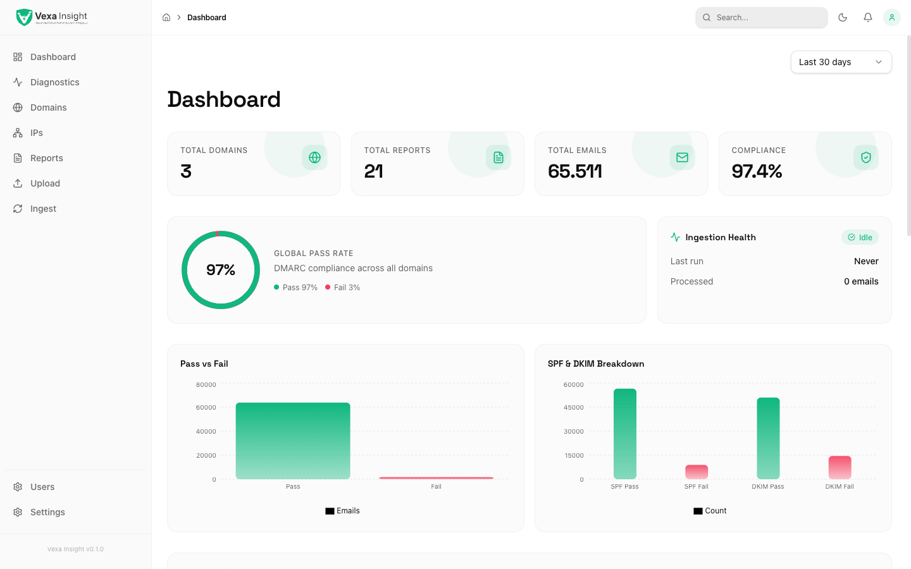
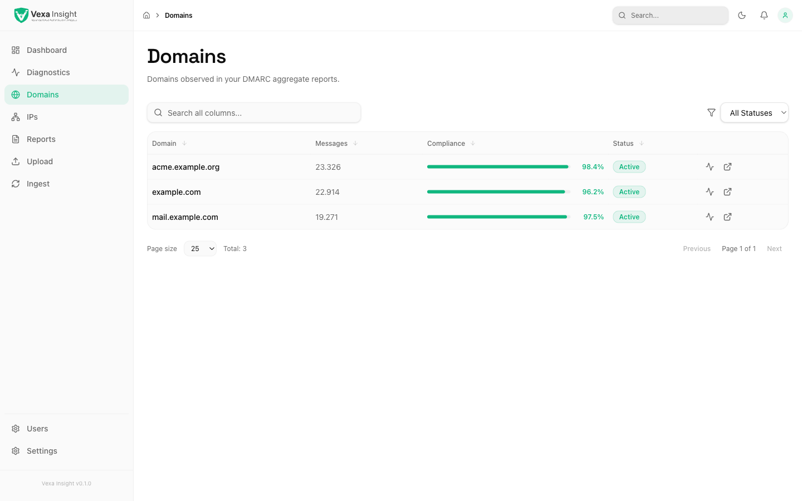
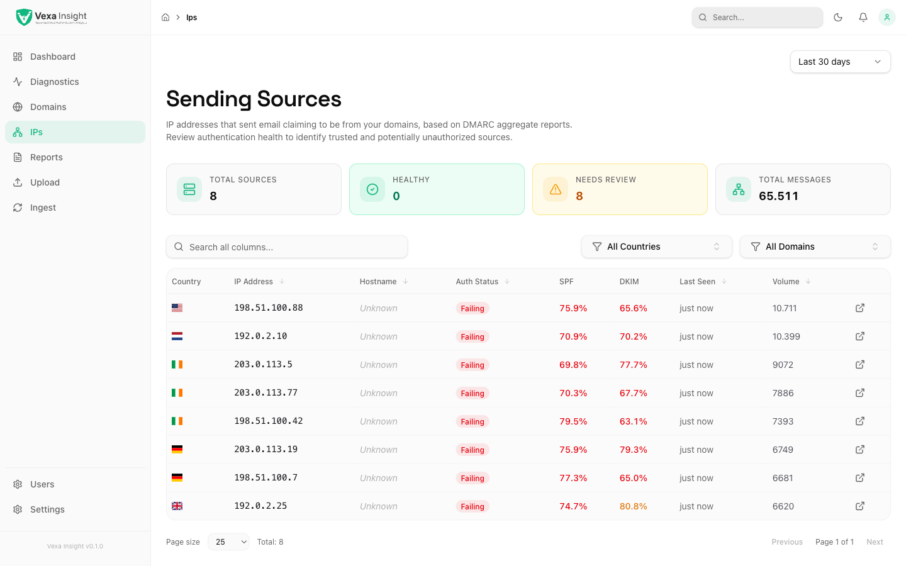
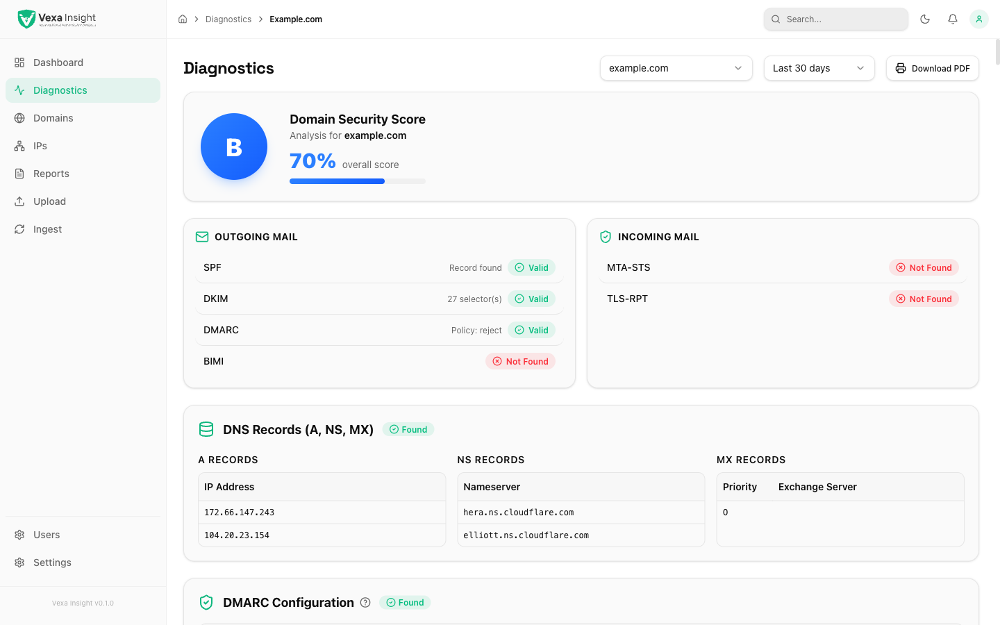

<div align="center">

# Vexa Mail Insight

### Self-hosted DMARC observability. Your data, your server, your dashboard.

[](https://github.com/VexaMail/vexa-insight-dashboard/actions/workflows/ci.yml)
[](https://github.com/VexaMail/vexa-insight-dashboard/releases)
[](https://github.com/VexaMail/vexa-insight-dashboard/pkgs/container/vexa-insight-dashboard)
[](https://www.apache.org/licenses/LICENSE-2.0)
[](https://github.com/VexaMail/vexa-insight-dashboard/stargazers)
[](CONTRIBUTING.md)

</div>

<p align="center">
  
</p>

**Vexa Mail Insight** turns raw DMARC aggregate reports (RUA) into a queryable security signal: who is sending mail using your domains, how SPF/DKIM are performing, where unauthorized senders are coming from. Built with Next.js 16, TypeScript, and Drizzle ORM. SQLite by default — **install in 30 seconds, no third party touches your data**.

<p align="center">
  <a href="docs/screenshots/domains.png"></a>
  <a href="docs/screenshots/ips.png"></a>
  <a href="docs/screenshots/diagnostics.png"></a>
</p>

---

## Quick start (30 seconds)

```bash
docker run -d --name vexa -p 3000:3000 \
  -v vexa-data:/app/data \
  ghcr.io/vexamail/vexa-insight-dashboard:latest
```

Then open <http://localhost:3000>, complete the web installer, and connect your DMARC mailbox (or run `pnpm run seed:demo` against a local checkout to see the dashboard with sample data first).

Prefer Compose? [`docker-compose.yml`](docker-compose.yml) bundles persistence and an opt-in Watchtower auto-update layer.

---

## Why self-host vs SaaS DMARC?

|                                  | Vexa Mail Insight (self-hosted)         | SaaS DMARC tools                                 |
| -------------------------------- | --------------------------------------- | ------------------------------------------------ |
| **Data location**                | Your server, your control               | Sent to a third party                            |
| **GDPR / SOC2 / data residency** | You decide — no DPA required            | Vendor risk review, DPA, data export negotiation |
| **Cost at scale**                | Infrastructure only                     | $$$ per domain / month, tiered                   |
| **Customization**                | Open source (Apache 2.0) — fork it      | Closed, feature requests at vendor pace          |
| **Air-gapped support**           | Yes (`VEXA_UPDATE_CHECK_ENABLED=false`) | No                                               |
| **Vendor lock-in**               | None — standard schema, exportable      | Migration friction                               |

If the answer to "can we ship our authentication logs to a SaaS vendor?" is _no, definitely not_, this project exists for you.

---

## Who is this for?

- **Security teams.** Detect phishing and spoofing campaigns abusing your domain — see the source IP, the reporting org, and the SPF/DKIM failure pattern.
- **Email infrastructure / deliverability.** Trend authentication pass rates over time, spot misconfigured ESPs, validate alignment after DNS changes.
- **MSPs and agencies** (roadmap: multi-tenant). Operate one Vexa instance to monitor DMARC for multiple customer domains.
- **Compliance / GRC.** Demonstrate continuous monitoring of email authentication policy enforcement without sending logs to an external processor.

---

## Highlights

- **IMAP ingestion** of DMARC aggregate reports (RUA) with `.zip` and `.gz` support, including zip-bomb protection.
- **Idempotent processing** keyed on `report_id`; duplicates are skipped.
- **Three-layer data model:** `RawReport` (audit), `NormalizedEvent` (query/analytics), optional `AggregatedMetric` (future precomputed metrics).
- **SQLite by default** — no extra setup. Switch to PostgreSQL or MySQL via `DATABASE_URL`; no app code changes.
- **Dashboard:** KPI cards, authentication trend chart, SPF/DKIM breakdown, disposition metrics, top sending IPs, ingestion health.
- **First-run web installer** at `/install` with permanent lockout after the first user is created.
- **CLI recovery** (`scripts/recovery.ts`) for password reset and admin creation when SMTP isn't available.
- **Hands-off auto-updates** via the bundled Watchtower override compose, or one-click "Apply update now" for source installs running under systemd / PM2.
- **Apache 2.0** with explicit patent grant — commercially safe.

---

## What you see (KPIs)

- Authentication pass/fail trend (SPF, DKIM, DMARC alignment) over a configurable date range.
- Top sending IPs and the geographic distribution of senders.
- Volume by reporting organization (Gmail, Microsoft, Yahoo, etc.) — anomalies flag possible deliverability incidents.
- Policy disposition breakdown (`none` / `quarantine` / `reject`).
- Domain drill-down with source IP analysis and per-report inspection.
- Ingestion health: last poll, scheduler status, error visibility.

---

## Architecture overview

**Application layers**

- **Next.js App Router:** UI (dashboard, domains, reports, settings, upload) and API routes under `/api/v1/`.
- **Background job runner:** in-Node scheduler (node-cron) for IMAP fetch and ingest; optional external trigger via `POST /api/v1/admin/trigger-poll` with API key.
- **DMARC ingestion pipeline:** fetch attachments from IMAP → parse XML (including from `.zip`/`.gz`) → normalize → persist with idempotency.
- **Database abstraction:** Drizzle ORM with SQLite by default and support for PostgreSQL/MySQL via `DATABASE_URL`.

**Data model**

- **RawReport:** original XML payload + metadata. Auditable, debuggable.
- **NormalizedEvent:** per-record structured data (domain, source IP, SPF/DKIM result + alignment, disposition, count, report window). Used for queries and dashboards.
- **AggregatedMetric** _(optional / future)_: precomputed metrics if you want them; otherwise computed from `NormalizedEvent` on demand.

---

## Tech stack

Next.js 16 · React 19 · TypeScript 5 · Drizzle ORM · SQLite (default) · Tailwind CSS 4 · Zod · node-cron · Docker. Tests with Vitest. CI with GitHub Actions. Multi-arch image (`linux/amd64`, `linux/arm64`) published to GHCR on every release.

---

## Installation Guide

**Requirements:** Node.js 22+, pnpm (recommended) for source installs. Docker 24+ for the image flow.

### Source install (SQLite default, no .env required)

```bash
git clone https://github.com/VexaMail/vexa-insight-dashboard.git
cd vexa-insight-dashboard
pnpm install
pnpm run seed:demo      # optional — populate sample data for first impression
pnpm dev                # open http://localhost:3000
```

The first time you load the app it redirects to `/install` for superadmin creation. Once a user exists, the installer locks itself permanently.

### Docker install

```bash
docker compose up -d              # builds + persists data + healthcheck
# or, fully hands-off auto-update:
docker compose -f docker-compose.yml -f docker-compose.watchtower.yml up -d
```

### Environment variables

| Variable                                                        | Required    | Description                                                                                                                                                                |
| --------------------------------------------------------------- | ----------- | -------------------------------------------------------------------------------------------------------------------------------------------------------------------------- |
| `DATABASE_URL`                                                  | No          | Default `file:./data/vexa.db`. Set to a PostgreSQL/MySQL connection string and run `pnpm run db:migrate`.                                                                  |
| `SECRET_KEY`                                                    | Recommended | Min 32 characters. Used for admin API auth (`X-API-Key` / `Authorization: Bearer`). Left as `CHANGE_ME`, admin API is disabled until you set it via installer or Settings. |
| `IMAP_SERVER` / `IMAP_PORT` / `IMAP_USERNAME` / `IMAP_PASSWORD` | No          | IMAP credentials. Can also be set in the Settings UI.                                                                                                                      |
| `INGESTION_INTERVAL_MINUTES`                                    | No          | Scheduler interval (default `60`).                                                                                                                                         |
| `INGESTION_DAYS_BACK`                                           | No          | Days of mailbox history to fetch (default `7`).                                                                                                                            |
| `PROJECT_NAME`                                                  | No          | Default `Vexa Mail Insight`.                                                                                                                                               |
| `ENVIRONMENT`                                                   | No          | `development` / `staging` / `production`.                                                                                                                                  |
| `VEXA_UPDATE_CHECK_ENABLED`                                     | No          | Default `true`. Set to `false`/`0`/`off` for airgapped deploys.                                                                                                            |
| `VEXA_UPDATE_REPO`                                              | No          | Override upstream repo (`owner/repo`) when running a fork.                                                                                                                 |

---

## Installation & Recovery

### First-time install (Bootstrap)

When you start with an empty database, you are redirected to `/install`. You must provide an admin email and password. Once at least one user exists, `/install` is permanently locked.

### Password recovery

OSS deployments may not have SMTP configured, so recovery is performed via CLI on the server:

```bash
# create new admin
npx tsx scripts/recovery.ts create-admin newadmin@example.com MySecurePassword123!

# reset existing password
npx tsx scripts/recovery.ts reset-password existingadmin@example.com NewPwd456!

# promote user to admin
npx tsx scripts/recovery.ts promote-user someuser@example.com

# hard reset (deletes all users; unlocks /install) — destructive
npx tsx scripts/recovery.ts hard-reset --confirm
```

### Seed demo data (optional)

```bash
pnpm run seed:demo            # idempotent — skips if already seeded
pnpm run seed:demo --force    # wipe demo data and reseed
```

Refuses to run with `NODE_ENV=production` unless `VEXA_FORCE_SEED_DEMO=1` is set. Only touches rows tagged with the `demo-` report-id prefix.

---

## Background Jobs

**IMAP polling.** When IMAP settings are configured (via env or Settings UI), the in-Node scheduler starts on server startup. It runs every `INGESTION_INTERVAL_MINUTES` (default 60), fetching new DMARC reports.

**Triggering ingestion**

- _Internal:_ the scheduler runs automatically.
- _External cron / script:_
  ```bash
  curl -X POST -H "X-API-Key: YOUR_API_KEY" https://your-host/api/v1/admin/trigger-poll
  ```
  Or `Authorization: Bearer YOUR_API_KEY`. Do not expose admin endpoints publicly.
- _Manual:_ the Settings → Updates panel exposes UI controls for installs that have a supervisor.

---

## Switching to PostgreSQL or MySQL

1. Set `DATABASE_URL` to your connection string.
2. Run `pnpm run db:migrate`.

No app code changes required. Recommended for production at scale and multi-process deployments.

---

## Updating

The dashboard checks GitHub once per day for new stable releases and shows an "Update available" indicator. Three upgrade paths:

1. **Hands-off auto-update with Watchtower** (recommended for Docker):
   ```bash
   docker compose -f docker-compose.yml -f docker-compose.watchtower.yml up -d
   ```
2. **Manual Docker upgrade:** `docker compose pull && docker compose up -d`.
3. **Source upgrade:** `git pull && pnpm install && pnpm build && pnpm start`.
4. **WordPress-style "Apply update now"** when running under systemd or PM2 — backs up the SQLite database, pulls the new tag, builds, and lets the supervisor restart the process. Logged in `data/self-update.log`, audited in `data/self-update.audit.log`. Examples in [`deploy/vexa.service`](deploy/vexa.service) and [`deploy/ecosystem.config.cjs`](deploy/ecosystem.config.cjs).

The check itself is notification-only — Vexa never modifies your filesystem on its own. Full details: [docs/UPDATING.md](docs/UPDATING.md).

---

## Roadmap

- **Phase 1 (current):** DMARC aggregate ingestion, normalization pipeline, dashboard analytics, SQLite default, optional PostgreSQL/MySQL, web installer, recovery CLI, self-update flow.
- **Phase 2:** Outbound webhook / Slack / Teams alerts, Prometheus metrics, OpenAPI spec, forensic reports (RUF).
- **Phase 3:** SSO (OIDC/SAML), multi-tenancy / RBAC for MSPs, reputation scoring, threat-intel enrichment, anomaly detection.
- **Phase 4:** Full Email Authentication Control Center.

---

## Integrations

The following endpoints are stable and meant for automation:

- `POST /api/v1/admin/trigger-poll` — kick off an ingestion run.
- `GET /api/v1/admin/update-check` / `POST /api/v1/admin/update-check` — read or refresh upstream release info.
- `GET /api/v1/admin/apply-update` / `POST /api/v1/admin/apply-update` — read or trigger the self-update flow (source installs with supervisor).
- `GET /api/v1/metrics` — Prometheus-format metrics.
- `GET /api/v1/health` — `200` if DB reachable, `503` otherwise (used by Docker `HEALTHCHECK`).
- `GET /api/v1/openapi.json` — machine-readable spec of public endpoints.

Outbound webhooks (Slack, Teams, generic) for "unauthorized source detected" and "ingest job failed" are configured in Settings.

---

## Contributing

Contributions welcome. Read [CONTRIBUTING.md](CONTRIBUTING.md) for setup, code style, and PR workflow. In short: fork, run `pnpm run check` before submitting, keep route handlers thin and logic in services, place types under `types/<area>/`, follow existing patterns (one export per file, Drizzle migrations for schema changes).

---

## Security

- Store IMAP credentials securely; never commit `.env`.
- Do not expose `/api/v1/admin/*` publicly. Protect with `SECRET_KEY` and run behind authentication in production.
- Admin API auth uses timing-safe comparison and refuses to authenticate when `SECRET_KEY` is unset or under 32 characters.
- Login is rate-limited (5 attempts / minute / IP).
- HTTP security headers (CSP, X-Frame-Options, HSTS, Referrer-Policy, Permissions-Policy) enabled by default.
- SQLite is fine for development. For production, consider PostgreSQL/MySQL plus appropriate file/network controls.

Report security issues privately as described in [SECURITY.md](SECURITY.md).

---

## License

Licensed under the [Apache License 2.0](https://www.apache.org/licenses/LICENSE-2.0). Commercial use permitted. No copyleft restrictions. Includes patent grant.

---

## Vision

Vexa Mail Insight aims to become the open standard for email authentication observability. We welcome contributors, security researchers, and infrastructure teams to use, extend, and improve it.
