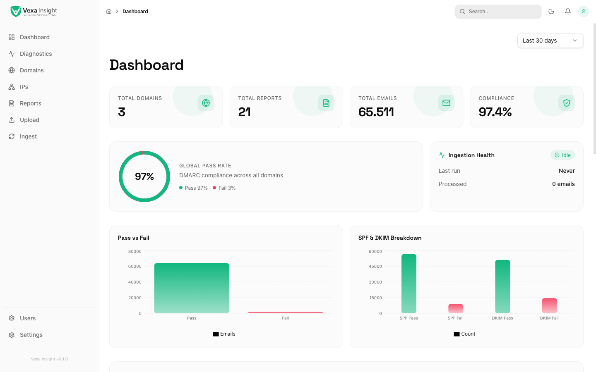
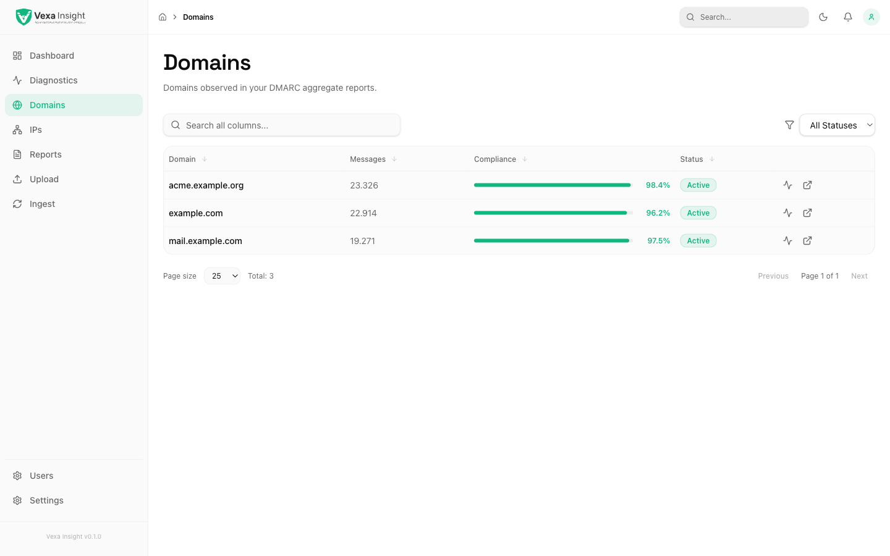
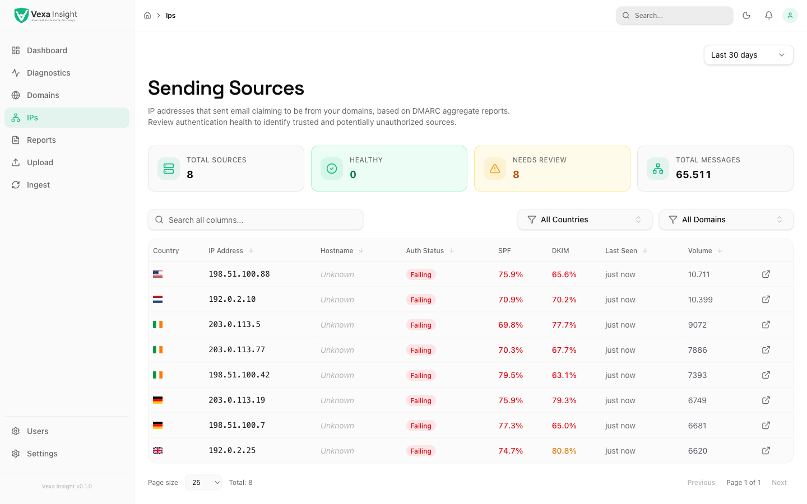
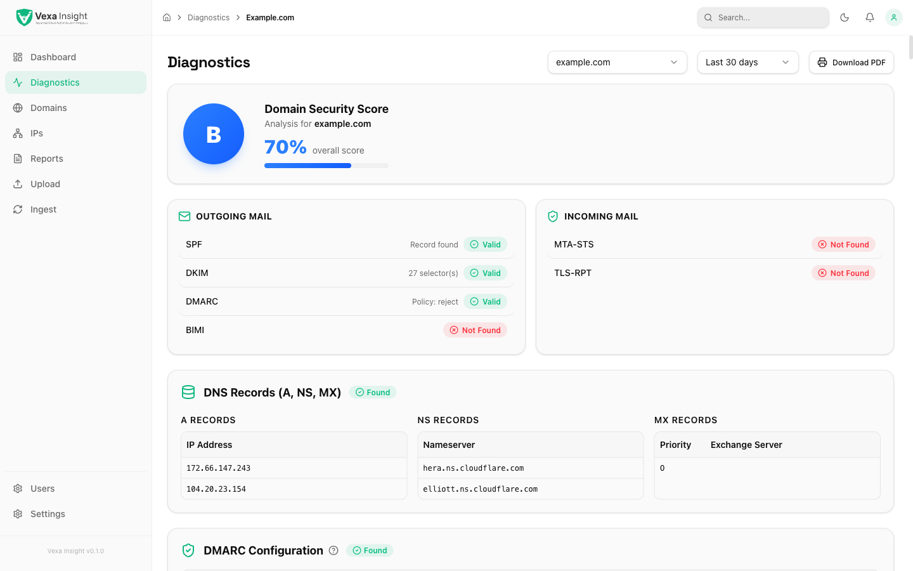

<div align="center">

# Vexa Insight

### Open-source, self-hosted DMARC report analyzer and dashboard.

Read the DMARC aggregate reports Google, Microsoft, Yahoo and every other
receiver send you, see who is sending mail as your domain, and fix SPF and DKIM
before you move to `p=quarantine` or `p=reject`. One Docker container, one
SQLite file, and your reports never leave your server.

[](https://github.com/VexaMail/vexa-insight/actions/workflows/ci.yml)
[](https://github.com/VexaMail/vexa-insight/releases)
[](https://github.com/VexaMail/vexa-insight/pkgs/container/vexa-insight)
[](https://www.apache.org/licenses/LICENSE-2.0)
[](https://github.com/VexaMail/vexa-insight/stargazers)
[](CONTRIBUTING.md)

</div>

<p align="center">
  
</p>

**Vexa Insight** turns raw DMARC aggregate reports (RUA XML, zipped or gzipped)
into answers: which servers send mail using your domains, whether their SPF and
DKIM results align with DMARC, which of them you do not recognise, and whether
it is safe to tighten your policy. It polls the mailbox your `rua=` address
points at over IMAP, or takes files you upload, and keeps everything in SQLite
on your own server. Nothing is sent to a Vexa service, because there isn't one;
the outbound calls the app does make are listed under
[What still leaves your server](#what-still-leaves-your-server), and every
optional one is off until you configure it.

<p align="center">
  <a href="docs/screenshots/domains.png"></a>
  <a href="docs/screenshots/ips.png"></a>
  <a href="docs/screenshots/diagnostics.png"></a>
</p>

---

## Quick start

```bash
docker run -d --name vexa \
  -p 127.0.0.1:3000:3000 \
  -v vexa-data:/app/data \
  -e SECRET_KEY=$(openssl rand -hex 32) \
  ghcr.io/vexamail/vexa-insight:latest

# Grab the one-time install token from the container logs:
docker logs vexa 2>&1 | grep -A1 'install token'
```

Then open <http://127.0.0.1:3000>, paste the install token into the web
installer, and connect your DMARC mailbox.

**No DMARC mailbox yet?** Bring up a throwaway container and fill it with
synthetic data — no mailbox, no credentials, no real domains:

```bash
docker exec -e VEXA_FORCE_SEED_DEMO=1 vexa node dist/seed-demo.cjs
```

Still worth using on an instance you intend to throw away. The seeder marks its
own rows and `--force` deletes only those, but the synthetic reports otherwise
sit in the same tables as real ones and skew every total on the dashboard.

### Start receiving reports

DMARC reports only arrive once your domain asks for them. Publish (or edit) the
`_dmarc` TXT record so its `rua=` tag points at a mailbox Vexa Insight can read
over IMAP:

```dns
_dmarc.example.com.  TXT  "v=DMARC1; p=none; rua=mailto:dmarc-reports@example.com"
```

`p=none` only monitors, so nothing you send is affected while you look at the
data. Receivers usually send one report per domain per day, so expect the first
ones within 24 to 48 hours. If the report mailbox is on a different domain from
the one being reported on, that domain must also publish an
[external destination record](https://www.rfc-editor.org/rfc/rfc7489#section-7.1)
(`example.com._report._dmarc.reports.example.net TXT "v=DMARC1"`). Already have
a pile of report files? Drop them on the **Upload** page (`.xml`, `.gz`,
`.zip`).

**Exposing beyond localhost?** Bind to all interfaces (`-p 3000:3000`), set
`-e VEXA_ALLOW_REMOTE_INSTALL=1`, and put it behind a reverse proxy with TLS —
see [`docs/UPDATING.md`](docs/UPDATING.md) and the env-var table below.

Prefer Compose? [`docker-compose.yml`](docker-compose.yml) bundles persistence,
the loopback bind, and an opt-in Watchtower auto-update layer.

---

## Project status

Early but not a demo. One person maintains it, and it runs the published image
in production on that person's own hosting estate, where as of 2026-09-16 it
holds **55 domains, 3,810 aggregate reports from 14 reporting organizations, and
63,329 messages** ingested continuously since July 2026, in a 51 MB SQLite file.

What that record does not yet show, stated so you can weigh it:

- Every event on that instance carries disposition `none`. The estate is in
  monitoring mode, so the tool has surfaced unaligned mail but has not yet been
  used to defend a move to `quarantine`.
- It has been operated by one person on one estate. The install path is
  exercised against the published image on every release, but not yet by
  strangers on infrastructure nobody here has seen. If it confuses you, that is
  worth an issue — that is the gap this stage is for.
- Forensic (RUF) report ingestion is planned, not built.

The full write-up, including what it cost to build and one release that shipped
a signature nobody could verify, is at
<https://cristiandeluxe.dev/work/vexa-insight/>.

---

## Why self-host vs SaaS DMARC?

|                                  | Vexa Insight (self-hosted)              | SaaS DMARC tools                                 |
| -------------------------------- | --------------------------------------- | ------------------------------------------------ |
| **Data location**                | Your server, your control               | Sent to a third party                            |
| **GDPR / SOC2 / data residency** | You decide — no DPA required            | Vendor risk review, DPA, data export negotiation |
| **Cost at scale**                | Infrastructure only                     | $$$ per domain / month, tiered                   |
| **Customization**                | Open source (Apache 2.0) — fork it      | Closed, feature requests at vendor pace          |
| **Air-gapped support**           | Yes (`VEXA_UPDATE_CHECK_ENABLED=false`) | No                                               |
| **Vendor lock-in**               | None — standard schema, exportable      | Migration friction                               |

If the answer to "can we ship our authentication logs to a SaaS vendor?" is _no,
definitely not_, this project exists for you.

### What still leaves your server

Self-hosted does not mean airgapped. Reports, the database and the dashboard
never leave the host, but these features reach the network, and every one of
them is either opt-in or can be turned off:

| Feature                   | Destination                                                      | Default            | What is sent                                                                     |
| ------------------------- | ---------------------------------------------------------------- | ------------------ | -------------------------------------------------------------------------------- |
| IMAP ingestion            | Your mailbox provider                                            | On once configured | IMAP credentials and fetch commands                                              |
| DNS diagnostics           | Your host's resolver                                             | On                 | Domain names you monitor                                                         |
| Reverse DNS on source IPs | Your host's resolver                                             | On                 | IPs that appear in your reports                                                  |
| MTA-STS policy fetch      | `https://mta-sts.<your-domain>/`                                 | On                 | Nothing beyond the request itself                                                |
| Update check              | `api.github.com`                                                 | On                 | Nothing beyond the request itself; `VEXA_UPDATE_CHECK_ENABLED=false` disables it |
| AI analysis               | Anthropic, OpenAI, Google or OpenRouter, whichever you configure | Off                | Aggregated DMARC findings and DNS records for the prompt                         |
| GeoIP database update     | MaxMind                                                          | Off                | Your MaxMind license key                                                         |
| Outbound webhooks         | The endpoints you add in Settings                                | Off                | The event envelope                                                               |

For a fully offline deployment, leave AI and GeoIP unconfigured, set
`VEXA_UPDATE_CHECK_ENABLED=false`, and point ingestion at a local mailbox.

### Compared with parsedmarc

[parsedmarc](https://github.com/domainaware/parsedmarc) is the established
open-source DMARC report parser, and a good choice if you already run
Elasticsearch, OpenSearch or Splunk: it parses reports and ships them there for
Kibana or Grafana dashboards, and it also parses failure (RUF) and SMTP TLS
(TLS-RPT) reports. Vexa Insight is the option for when you want the dashboard
without that stack: one container with its own UI, users and SQLite storage,
plus live DNS diagnostics of your SPF, DKIM, DMARC, MTA-STS and BIMI records. It
parses aggregate, failure (RUF) and TLS-RPT reports.

---

## Who is this for?

- **Security teams.** Detect phishing and spoofing campaigns abusing your domain
  — see the source IP, the reporting org, and the SPF/DKIM failure pattern.
- **Email infrastructure / deliverability.** Trend authentication pass rates
  over time, spot misconfigured ESPs, validate alignment after DNS changes.
- **MSPs and agencies** (roadmap: multi-tenant). Operate one Vexa instance to
  monitor DMARC for multiple customer domains.
- **Compliance / GRC.** Demonstrate continuous monitoring of email
  authentication policy enforcement without sending logs to an external
  processor.

---

## Features

**Reports and ingestion**

- Pulls DMARC aggregate reports (RUA) from one or more IMAP mailboxes on a
  schedule, or from files you upload; `.xml`, `.zip` and `.gz`, with zip-bomb
  protection.
- Pulls SMTP TLS reports (TLS-RPT, RFC 8460) from the same mailboxes, gzip or
  plain JSON, and shows successful and failed inbound TLS sessions per reporter
  on each domain page, with failures grouped by cause and receiving MX.
- Pulls DMARC failure reports (RUF, RFC 6591 ARF), recognised by their MIME
  structure since they often keep the failed message's subject. Only identifiers
  are kept (source IP, header and envelope From domains, DKIM domain and
  selector, List-Id, Message-ID); no subject, body or full address is stored,
  and each domain is capped at 500 reports a day.
- Idempotent: each report is stored once, keyed on its `report_id`, however
  often the mail is fetched.
- Keeps the original XML for audit next to the normalized rows the dashboard
  queries, with a built-in viewer.
- Moves processed mail to Trash or marks it read, if you want the mailbox kept
  clean.

**Dashboard**

- DMARC, SPF and DKIM pass rates and alignment over any date range, per domain
  and overall.
- Every sending source by IP, with reverse DNS hostname, country and the reports
  that listed it, so an unknown sender stands out.
- Sources named after the service behind them (Google Workspace, Microsoft 365,
  Amazon SES, SendGrid, Mailchimp, Brevo, Klaviyo and about fifty more) from
  their reverse DNS or DKIM signing domain, using a catalog in
  `src/constants/senders/senderCatalog.json` that takes one entry per service.
- Policy dispositions (`none`, `quarantine`, `reject`) and volume by reporting
  organisation (Google, Microsoft, Yahoo and others).
- Ingestion health: last poll, per-run results and errors, and a health endpoint
  that flags a stalled scheduler.

**Domain diagnostics**

- Live DNS checks of SPF (lookup count, macros, the full include tree), DKIM key
  strength, the DMARC record, MTA-STS, TLS-RPT and BIMI, with a security score
  per domain.
- Optional AI analysis of those findings through Anthropic, OpenAI, Google or
  OpenRouter, with your own API key. Off by default.

**Reputation and alerts**

- Microsoft SNDS integration: daily IP reputation, complaint rates and trap hits
  for your sending IPs, next to the DMARC data. See
  [`docs/SNDS.md`](docs/SNDS.md).
- Outbound webhooks for unauthorized senders, authentication fail-rate spikes,
  failed ingestion, SNDS reputation alerts and available updates, optionally
  HMAC-signed.
- Prometheus metrics at `/api/v1/metrics` and an OpenAPI 3.1 spec at
  `/api/v1/openapi.json`.

**Operations**

- First-run web installer, with a one-time token and permanent lockout after the
  first admin exists.
- Recovery CLI for password resets and admin creation without SMTP.
- Update check against GitHub releases, Watchtower auto-updates for Docker, or
  one-click "Apply update now" under systemd or PM2.
- Multi-arch image (`linux/amd64`, `linux/arm64`), signed Helm chart, Apache 2.0
  licence with an explicit patent grant.

---

## Architecture overview

**Application layers**

- **Next.js App Router:** UI (dashboard, domains, reports, settings, upload) and
  API routes under `/api/v1/`.
- **Background job runner:** in-Node scheduler (node-cron) for IMAP fetch and
  ingest; optional external trigger via `POST /api/v1/admin/trigger-poll` with
  API key.
- **DMARC ingestion pipeline:** fetch attachments from IMAP → parse XML
  (including from `.zip`/`.gz`) → normalize → persist with idempotency.
- **Database:** Drizzle ORM on SQLite (`better-sqlite3`).

**Data model**

- **RawReport:** original XML payload + metadata. Auditable, debuggable.
- **NormalizedEvent:** per-record structured data (domain, source IP, SPF/DKIM
  result + alignment, disposition, count, report window). Used for queries and
  dashboards.
- **AggregatedMetric** _(optional / future)_: precomputed metrics if you want
  them; otherwise computed from `NormalizedEvent` on demand.

---

## Tech stack

Next.js 16 · React 19 · TypeScript · Drizzle ORM · SQLite (default) · Tailwind
CSS 4 · Zod · node-cron · Docker. Tests with Vitest. CI with GitHub Actions.
Multi-arch image (`linux/amd64`, `linux/arm64`) published to GHCR on every
release.

---

## Installation Guide

**Requirements:** Node.js 22+, pnpm (recommended) for source installs. Docker
24+ for the image flow.

### Source install (SQLite default, no .env required)

```bash
git clone https://github.com/VexaMail/vexa-insight.git
cd vexa-insight
pnpm install
pnpm run seed:demo      # optional — populate sample data for first impression
pnpm dev                # open http://localhost:3000
```

The first time you load the app it redirects to `/install` for superadmin
creation. Once a user exists, the installer locks itself permanently.

### Docker install

```bash
docker compose up -d              # pulls the image + persists data + healthcheck
# or, fully hands-off auto-update:
docker compose -f docker-compose.yml -f docker-compose.watchtower.yml up -d
```

### Kubernetes (Helm)

The chart is published to GitHub Container Registry as an OCI artifact on every
release, signed with cosign, and its `appVersion` is checked against
`package.json` in CI so a default install cannot pull a tag that was never
published.

```bash
helm install vexa-insight oci://ghcr.io/vexamail/charts/vexa-insight \
  --version 0.3.3
```

Verify the signature before installing:

```bash
cosign verify ghcr.io/vexamail/charts/vexa-insight:0.3.3 \
  --certificate-identity-regexp '^https://github.com/VexaMail/vexa-insight/' \
  --certificate-oidc-issuer https://token.actions.githubusercontent.com
```

The chart source is in [`deploy/helm/vexa-insight`](deploy/helm/vexa-insight);
`values.yaml` documents the ingress, persistence and resource settings.

### Environment variables

| Variable                     | Required     | Description                                                                                                                                                                                                                                          |
| ---------------------------- | ------------ | ---------------------------------------------------------------------------------------------------------------------------------------------------------------------------------------------------------------------------------------------------- |
| `DATABASE_URL`               | No           | SQLite file path, default `file:./data/vexa.db`.                                                                                                                                                                                                     |
| `SECRET_KEY`                 | **Required** | Min 32 characters. Encrypts stored mailbox credentials, and the admin API token is derived from it. Read from the environment only; the installer refuses to run without it. Keep it: losing it loses the stored credentials.                        |
| `INGESTION_INTERVAL_MINUTES` | No           | Scheduler interval (default `60`). Seeded into settings on first boot only; afterwards the stored value wins, so change it in Settings.                                                                                                              |
| `INGESTION_DAYS_BACK`        | No           | Days of mailbox history each run fetches (default `30`, minimum `1`). Seeded like `INGESTION_INTERVAL_MINUTES`. A full-mailbox pass is a one-off action from the ingest page.                                                                        |
| `ENVIRONMENT`                | No           | Environment label, `development` / `staging` / `production`. Seeded like `INGESTION_INTERVAL_MINUTES`.                                                                                                                                               |
| `VEXA_IMAP_DEBUG`            | No           | Default `false`. Set to `true` to log the IMAP protocol trace (contains subjects and addresses).                                                                                                                                                     |
| `VEXA_UPDATE_CHECK_ENABLED`  | No           | Default `true`. Set to `false`/`0`/`off` for airgapped deploys.                                                                                                                                                                                      |
| `VEXA_UPDATE_REPO`           | No           | Override upstream repo (`owner/repo`) when running a fork.                                                                                                                                                                                           |
| `VEXA_ALLOW_REMOTE_INSTALL`  | No           | Default `0`. The web installer rejects non-loopback requests unless this is `1`. Required when the installer is reached via a reverse proxy / public hostname.                                                                                       |
| `VEXA_ALLOWED_ORIGINS`       | No           | Comma-separated origins (e.g. `https://dmarc.example.com`) allowed to invoke Next.js Server Actions. Required when the public hostname differs from the upstream origin.                                                                             |
| `VEXA_TRUSTED_PROXY_HOPS`    | No           | Default `1`. How many reverse proxies in front of the app append to `X-Forwarded-For`; the client address for rate limits and audit logs is read that many entries from the right. See [`docs/DEPLOY-BEHIND-PROXY.md`](docs/DEPLOY-BEHIND-PROXY.md). |

---

## Installation & Recovery

### First-time install (Bootstrap)

When you start with an empty database, you are redirected to `/install`. You
must provide an admin email and password. Once at least one user exists,
`/install` is permanently locked.

### Password recovery

OSS deployments may not have SMTP configured, so recovery is performed via CLI
on the server. Run it from the install directory, where `DATABASE_URL` points at
the database you want to repair:

In a container the same CLI is bundled at `dist/recovery.cjs`, so use
`docker exec -it vexa node dist/recovery.cjs <command>` in place of the
`npx tsx scripts/recovery.ts` prefix below.

```bash
# create new admin
npx tsx scripts/recovery.ts create-admin newadmin@example.com MySecurePassword123!

# reset existing password
npx tsx scripts/recovery.ts reset-password existingadmin@example.com NewPwd456!

# promote user to admin
npx tsx scripts/recovery.ts promote-user someuser@example.com

# hard reset (deletes all users; unlocks /install) — destructive
npx tsx scripts/recovery.ts hard-reset --confirm
```

### Seed demo data (optional)

```bash
# source checkout
pnpm run seed:demo            # idempotent — skips if already seeded
pnpm run seed:demo --force    # wipe demo data and reseed

# container (demo instances only, see the warning below)
docker exec -e VEXA_FORCE_SEED_DEMO=1 vexa node dist/seed-demo.cjs
```

Refuses to run with `NODE_ENV=production` unless `VEXA_FORCE_SEED_DEMO=1` is
set, which is why the container form has to pass it.

> **Prefer an instance you can throw away.** `--force` deletes only rows the
> seeder wrote, which it marks at insert time, so it will not touch a real
> report. The synthetic ones still land in the same tables and count towards
> every total the dashboard shows.

---

## Background Jobs

**IMAP polling.** When IMAP settings are configured (via env or Settings UI),
the in-Node scheduler starts on server startup. It runs every
`INGESTION_INTERVAL_MINUTES` (default 60), fetching new DMARC reports.

**Triggering ingestion**

- _Internal:_ the scheduler runs automatically.
- _External cron / script:_
  ```bash
  curl -X POST -H "X-API-Key: YOUR_API_KEY" https://your-host/api/v1/admin/trigger-poll
  ```
  Or `Authorization: Bearer YOUR_API_KEY`. The key is the 64-character token
  shown on the settings page, not `SECRET_KEY` itself: it is derived from
  `SECRET_KEY`, so it changes when you rotate the key and cannot be turned back
  into it. Do not expose admin endpoints publicly.
- _Manual:_ the Settings → Updates panel exposes UI controls for installs that
  have a supervisor.

---

## Updating

The dashboard checks GitHub once per day for new stable releases and shows an
"Update available" indicator. Three upgrade paths:

1. **Hands-off auto-update with Watchtower** (recommended for Docker):
   ```bash
   docker compose -f docker-compose.yml -f docker-compose.watchtower.yml up -d
   ```
2. **Manual Docker upgrade:** `docker compose pull && docker compose up -d`.
3. **Source upgrade:** `git pull && pnpm install && pnpm build && pnpm start`.
4. **WordPress-style "Apply update now"** when running under systemd or PM2 —
   backs up the SQLite database, pulls the new tag, builds, and lets the
   supervisor restart the process. Logged in `data/self-update.log`, audited in
   `data/self-update.audit.log`. Examples in
   [`deploy/vexa.service`](deploy/vexa.service) and
   [`deploy/ecosystem.config.cjs`](deploy/ecosystem.config.cjs).

The check itself is notification-only — Vexa never modifies your filesystem on
its own. Full details: [docs/UPDATING.md](docs/UPDATING.md).

Migrations run on boot, but existing installs must run a one-time rollup
backfill after upgrading to the release that introduced the `event_rollup_daily`
table (`pnpm run backfill:rollup` from source, or
`docker compose exec web node dist/backfill-rollup.cjs` in Docker) — until then
the dashboard totals lag your data. See
[One-time post-upgrade steps](docs/UPDATING.md#one-time-post-upgrade-steps).

---

## Roadmap

- **Phase 1 (current):** DMARC aggregate ingestion, normalization pipeline,
  dashboard analytics, SQLite storage, web installer, recovery CLI, self-update
  flow.
- **Phase 2:** Slack / Teams webhook adapters. Webhook delivery retries, failure
  reports (RUF), SMTP TLS reports (TLS-RPT), generic outbound webhooks,
  Prometheus metrics and the OpenAPI spec already ship.
- **Phase 3:** SSO (OIDC/SAML), multi-tenancy / RBAC for MSPs, reputation
  scoring, threat-intel enrichment, anomaly detection.
- **Phase 4:** Full Email Authentication Control Center.

---

## Integrations

The following endpoints are stable and meant for automation:

- `POST /api/v1/admin/trigger-poll` — kick off an ingestion run.
- `GET /api/v1/admin/update-check` / `POST /api/v1/admin/update-check` — read or
  refresh upstream release info.
- `GET /api/v1/admin/apply-update` / `POST /api/v1/admin/apply-update` — read or
  trigger the self-update flow (source installs with supervisor).
- `GET /api/v1/metrics` — Prometheus-format metrics.
- `GET /api/v1/health` — `200` if DB reachable, `503` otherwise (used by Docker
  `HEALTHCHECK`). The body's `ingest` field is `stale` when scheduled ingestion
  runs have stopped arriving, so an uptime monitor can alert on it.
- `GET /api/v1/openapi.json` — machine-readable spec of public endpoints.

Outbound webhooks are configured in Settings, for the events
`unauthorized_source.detected`, `auth.fail_rate_spike`, `ingest.failed`,
`snds.reputation_alert`, `tls.failure_detected`, `failure_report.received` and
`update.available`. Each endpoint receives a generic JSON envelope (`event`,
`timestamp`, `source`, `data`) by `POST`, optionally signed with an HMAC-SHA256
`x-vexa-signature` header when the endpoint has a secret. Each request has a 5s
timeout; network errors, timeouts, HTTP 429 and 5xx are retried up to three
times after 1, 4 and 16 seconds, while other 4xx responses and URLs rejected by
the SSRF guard are not. The last status, error and attempt count are stored per
endpoint. Slack and Microsoft Teams expect their own payload shapes, so they
need a small receiver or relay in front of this envelope, and native adapters
are Phase 2 on the roadmap.

---

## FAQ

**What is a DMARC aggregate report?** An XML file that a receiving mail server
(Gmail, Outlook, Yahoo and so on) sends to the address in your DMARC record's
`rua=` tag, usually once a day. It lists every IP that sent mail using your
domain in that period, how many messages, and whether each passed SPF, DKIM and
DMARC alignment. It is the only way to see mail sent as your domain by servers
you do not control.

**Is it safe to move from `p=none` to `p=quarantine`?** When every legitimate
source you see here passes DMARC, through aligned SPF or aligned DKIM, and what
still fails is either unknown or a forwarder you accept losing. The Sending
Sources page is built to answer that question per domain.

**Why do mailing-list posts show up as failures?** Lists and forwarders often
rewrite the message, which breaks DKIM, and send it from their own servers,
which breaks SPF alignment. A report counts every delivered copy, so one post to
a large list can appear as thousands of failed messages. Those are not spoofing.

**Does it work without Docker?** Yes: see
[Source install](#source-install-sqlite-default-no-env-required). It needs
Node.js 22 or later.

---

## Contributing

Contributions welcome. Read [CONTRIBUTING.md](CONTRIBUTING.md) for setup, code
style, and PR workflow. In short: fork, run `pnpm run check` before submitting,
keep route handlers thin and logic in services, place types under
`src/types/<area>/`, follow existing patterns (one export per file, Drizzle
migrations for schema changes).

---

## Security

- Store IMAP credentials securely; never commit `.env`.
- Do not expose `/api/v1/admin/*` publicly. Protect with the admin API token and
  run behind authentication in production.
- The admin API token is derived from `SECRET_KEY` with HKDF-SHA256 under its
  own info label, so the token every automation client holds is not the key that
  decrypts the mailbox credentials, and nothing recovers one from the other.
- Admin API auth uses timing-safe comparison and refuses to authenticate when
  `SECRET_KEY` is unset or under 32 characters.
- The token is not an all-access role. On permission-checked routes it grants
  report reads/writes, settings reads and AI invocation only; user management,
  the audit log and configuration writes require a signed-in admin session.
- Login is rate-limited (5 attempts / minute / IP).
- HTTP security headers (CSP, X-Frame-Options, HSTS, Referrer-Policy,
  Permissions-Policy) enabled by default.
- SQLite is the only supported database. There is no PostgreSQL or MySQL driver
  in the application; production hardening means file permissions, backups and
  network controls around that database file.

### Where the encryption key lives

Stored IMAP passwords and the AI provider key are encrypted with a key derived
from `SECRET_KEY`, and `SECRET_KEY` comes from the environment. Nothing writes
it to disk inside the database, there is no settings field for it, and there is
no fallback that reads it back out of `vexa.db`. A leaked database file is
therefore not enough to recover a mailbox password.

The cost is the obvious one: lose the key and the stored credentials are gone
with it. Back it up wherever you keep the rest of your secrets. Rotate it with
the instance stopped:

```bash
docker compose stop vexa
docker compose run --rm vexa node dist/recovery.cjs rotate-key "$NEW_KEY"
# then set SECRET_KEY to the new value and start again
docker compose up -d vexa
```

Releases up to and including 0.2.2 seeded the environment value into
`app_settings.secret_key`, so every instance installed before 0.3.0 kept the key
next to the ciphertext. Upgrading clears that column and runs `VACUUM`, which
rewrites the file so the freed bytes go with it. **Any backup taken before the
upgrade still holds the key, and no upgrade can reach a copy someone already
has: if your instance ran 0.2.2 or earlier, rotate.** If you had rotated the key
through the old settings page, set `SECRET_KEY` to that rotated value before
upgrading; the boot log says so if you do not. See
[ADR 0010](docs/adr/0010-secret-key-is-environment-only.md).

Report security issues privately as described in [SECURITY.md](SECURITY.md).

---

## License

Licensed under the
[Apache License 2.0](https://www.apache.org/licenses/LICENSE-2.0). Commercial
use permitted. No copyleft restrictions. Includes patent grant.

---

## Vision

Vexa Insight aims to become the open standard for email authentication
observability. We welcome contributors, security researchers, and infrastructure
teams to use, extend, and improve it.
